# Shopping List App
This Java GUI application is designed to help users efficiently manage their shopping lists. <br>
It provides a user-friendly interface for organizing products into categories, adding new items, specifying units, and saving or clearing the list.

<br>
<br>
<br>

# Key Features:
1. Adding New Categories:
   * Users can create custom categories (e.g., "Food," "Furniture," "Cleaning Supplies") to organize their shopping list.
   * Categories are displayed in a dropdown menu while adding new product for easy navigation.
2. Adding Products:
   * Users can add products to any category by specifying the product name, quantity, and unit.
3. Choosing Units for Products:
   * The app supports a variety of units (e.g., kg, g, l, ml, m, x) for different types of products.
   * Users can select the appropriate unit from a dropdown menu when adding a product.
4. Automatic Save:
   * The shopping list is automatically saved to a file (*shopping_list.txt*) whenever the app is closed.
5. Clearing the Shopping List:
   * User can delete every item added to the shopping list by clicking `X` button placed next to the item.
   * User can clear the entire shopping list by using `Clear Shopping List` button.
   * A confirmation dialog ensures that accidental deletion of whole shopping list is avoided.
6. Viewing the Shopping List:
   * The app displays the shopping list in a structured format, grouped by categories.
7. User-Friendly Interface:
   * The GUI is designed to be intuitive, with buttons, dropdowns, and text fields for easy input.
   * The layout is clean and organized, making it simple to navigate.

<br>
<br>
<br>

# Screenshots:
## Start of the app:
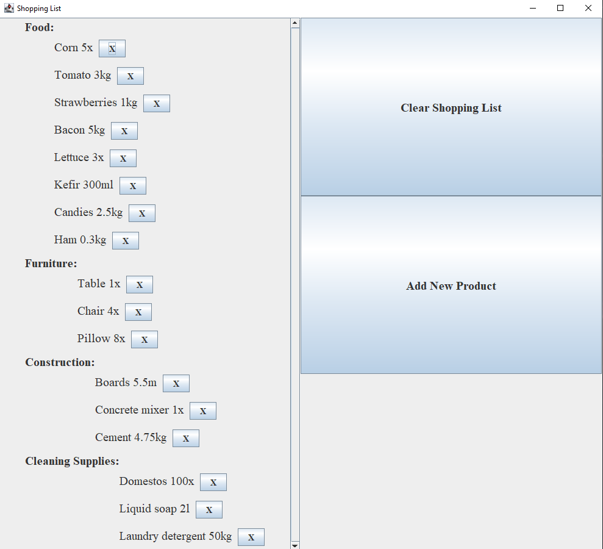<br><br>

## Adding new product:
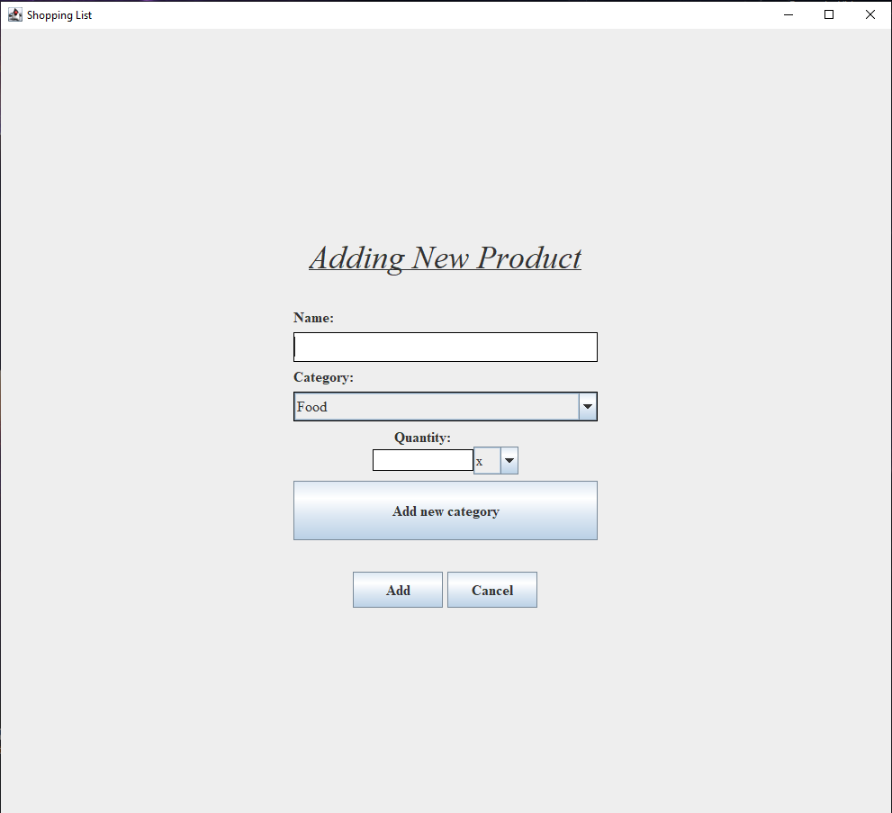<br><br>
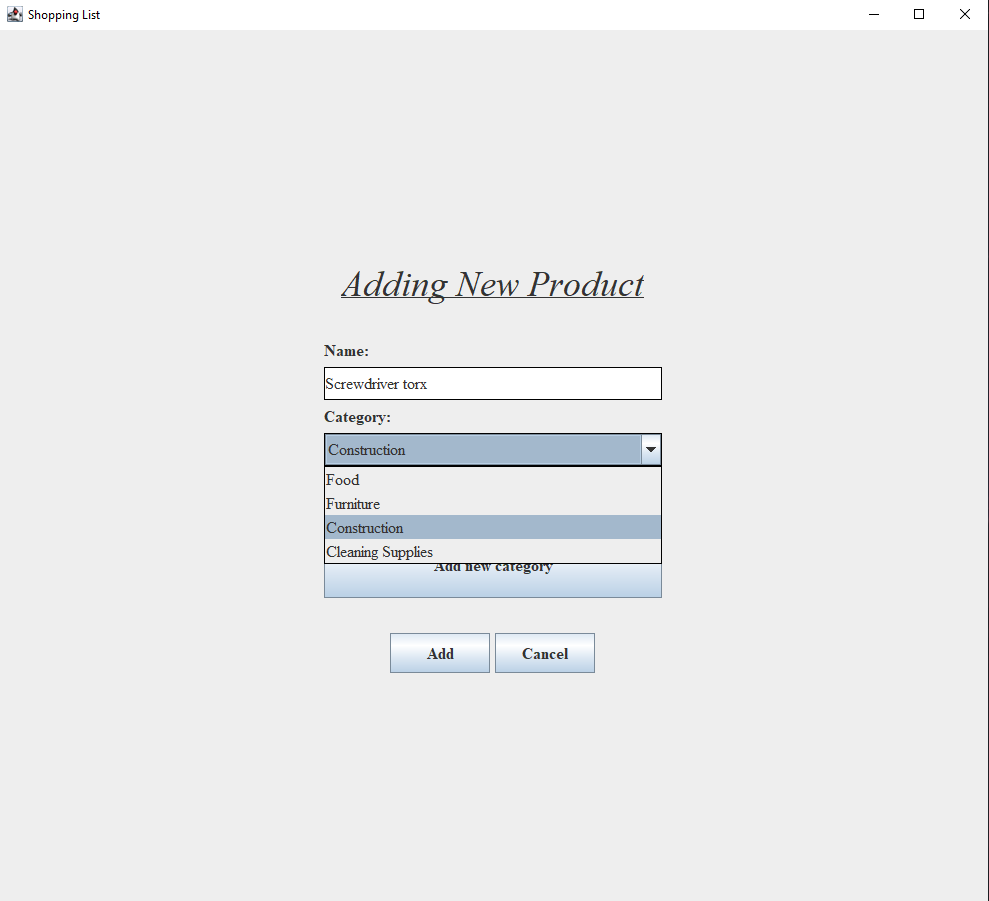<br><br>
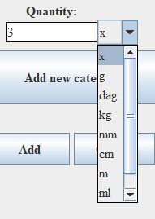<br><br>
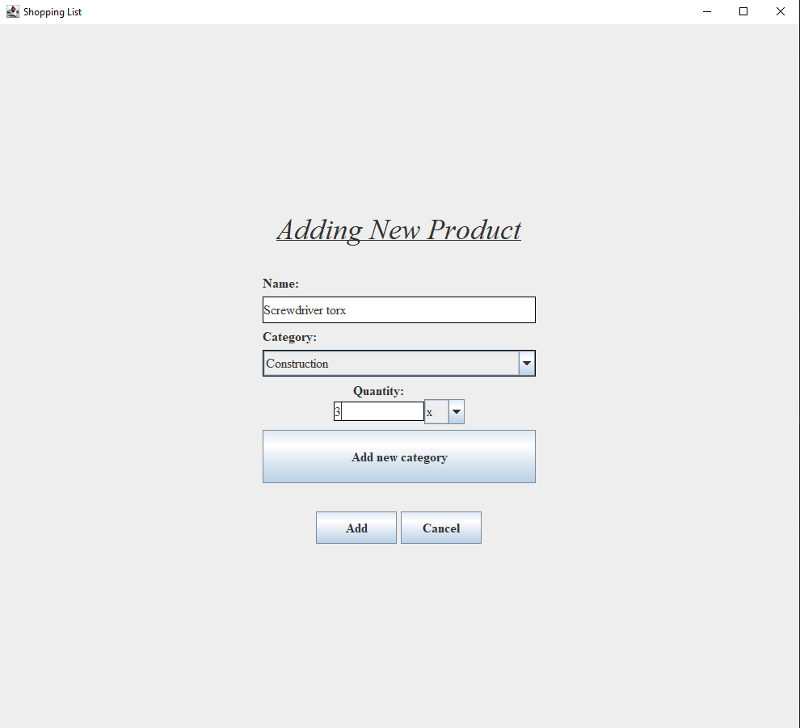<br><br>
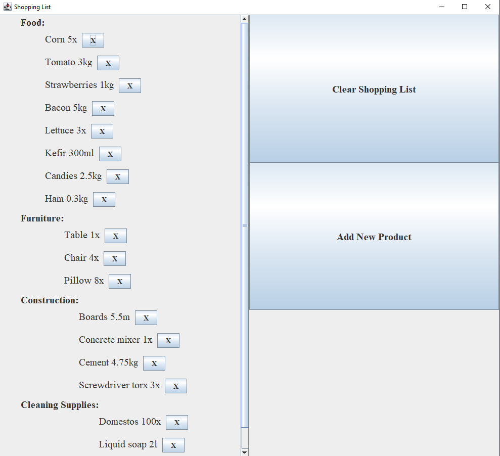<br><br>

## Adding new category:
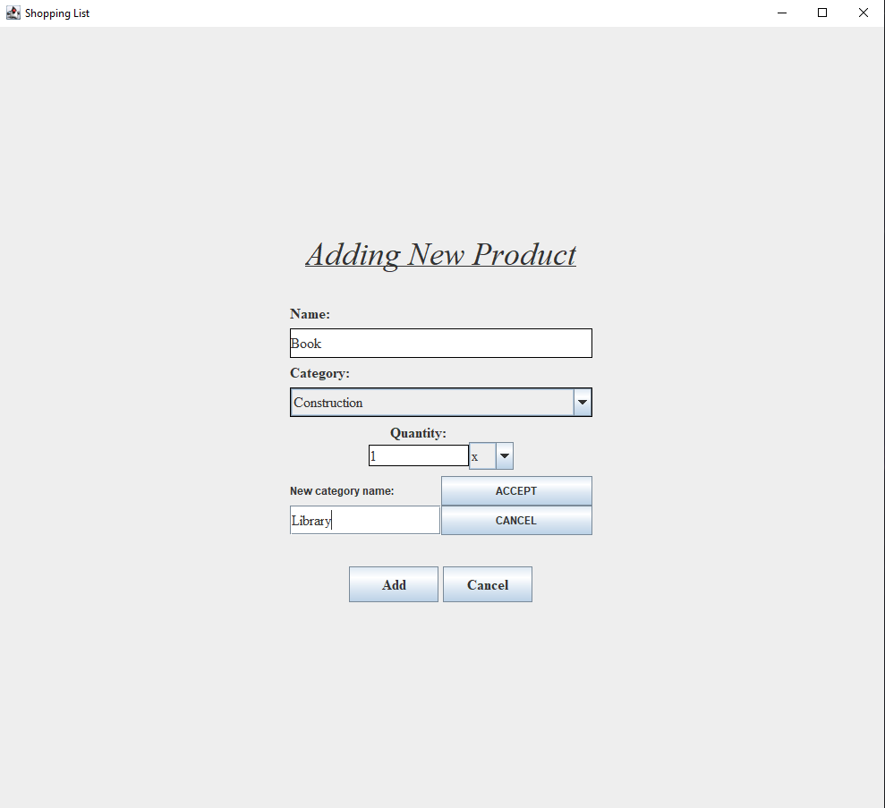<br><br>
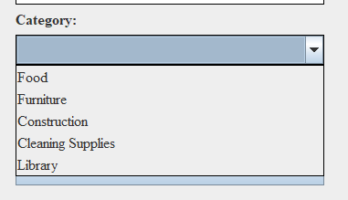<br><br>
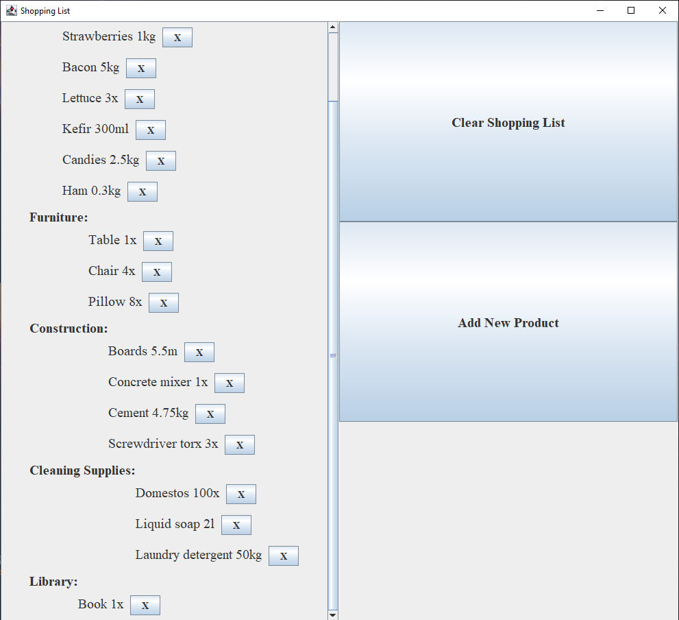<br><br>

## Clearing shopping list:
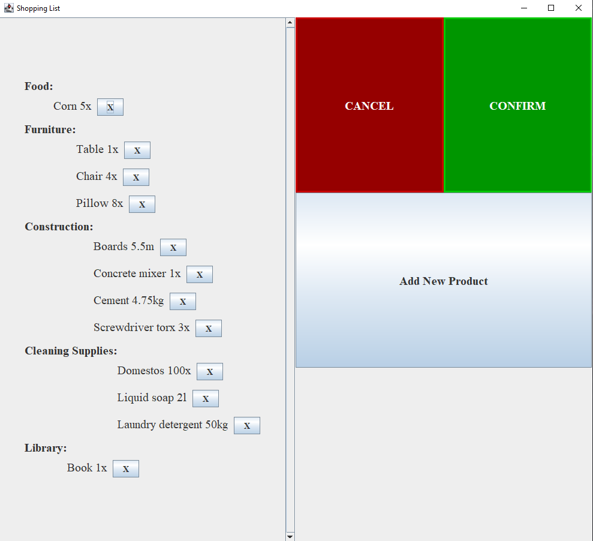<br><br>
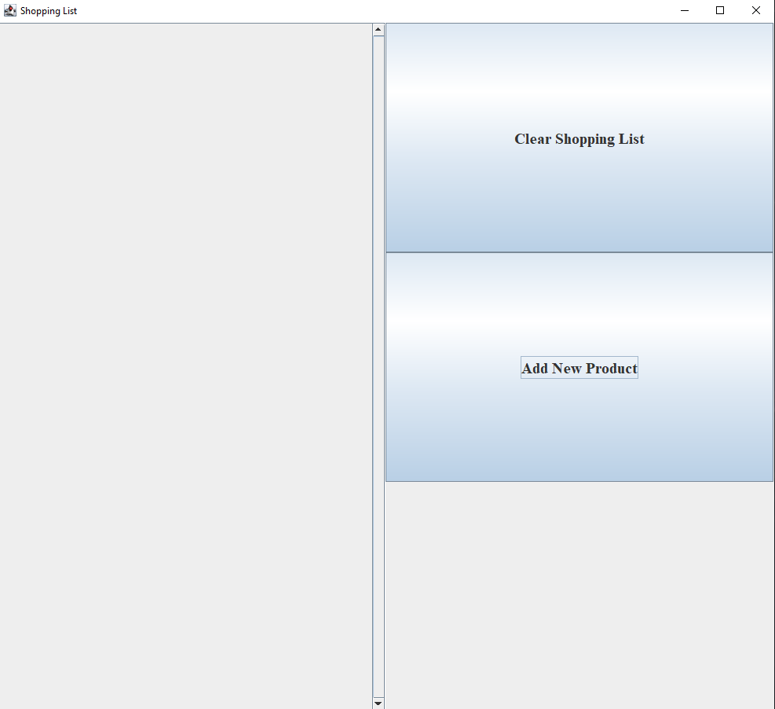<br><br>

<br>
<br>
<br>

# Instalation and launching the app:

## Required Technologies and Programs:
1. Java added to PATH (version 21)

<br>
<br>

## Launching Steps:
1. Launch CMD/Terminal and go to location of the ShoppingListApp folder
2. Go to `/src` and run commands:
```
javac App.java
java App
```

> [!NOTE]
> After first launch of the app, every next time you just need to type `java App` to launch it.
